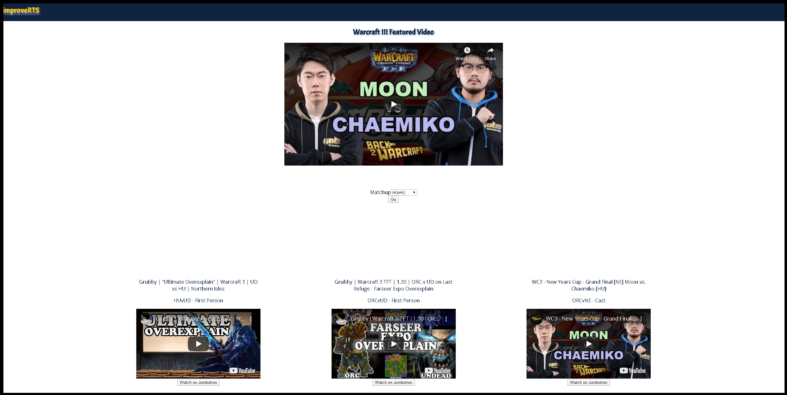

ImproveRTS is a video database for RTS gamers to improve their gameplay.
https://improverts.now.sh/

## Summary

Users can select their game of choice, and then enter the video log for that game. Either browse all provided videos, or filter by "game matchup". The videos are hand selected with the intent of educating strategy.

## Technologies used

ImproveRTS had a ReactJS front end, with a Node (express) and PostgreSQL backend.

## How to use

You can either visit the live site at https://improverts.now.sh/, or download the repo and run the following:

### `npm start`

Runs the app in the development mode. 
Open [http://localhost:3000](http://localhost:3000) to view it in the browser.

The page will reload if you make edits. 
You will also see any lint errors in the console.

### `npm test`

Tests the happy-path of all of the endpoints. 

